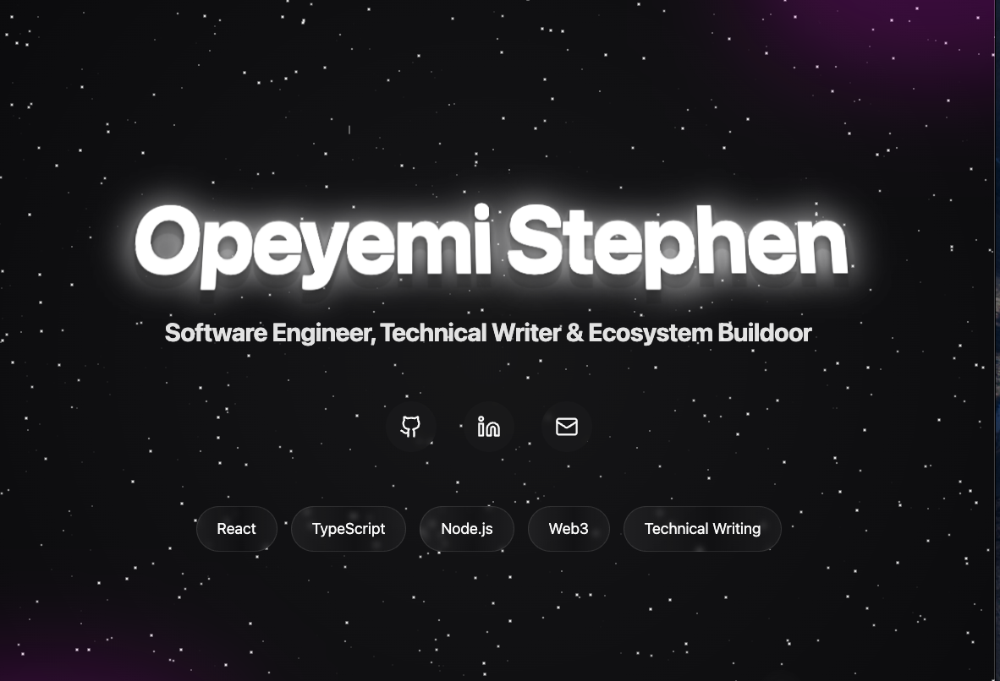

# Opeyemi's Portfolio

Welcome to my digital space! Built with React and TypeScript, featuring a unique dark/light theme transition. I tried to be a little creative.




## 🎯 Technical Highlights

- **Optimized Animations** - Utilizing Framer Motion's `AnimatePresence` for seamless transitions
- **Custom Hooks** - Efficient theme management and animation state handling
- **Advanced CSS** - Blend modes, dynamic shadows, and custom keyframe animations
- **Performance First** - Lazy loading, optimized assets, and smooth 60fps animations
- **Type Safety** - Strict TypeScript implementation for robust code quality

## 🛠 Built With

- React & TypeScript
- Framer Motion 
- Tailwind CSS 
- Satoshi font 
- Lucide Icons

## 🚀 Running the Project

1. Clone it:
```bash
git clone https://github.com/resourcefulmind/opeyemistephen.git
cd opeyemistephen
```

2. Install what you need:
```bash
npm install
```

3. Start it up:
```bash
npm run dev
```

4. View it at [http://localhost:5173](http://localhost:5173)

### Animation Timing

Want to adjust the animations? Check `src/components/Hero.tsx`:

## 🔧 Project Layout

```
portfolio-blog/
├── src/
│   ├── components/        # React components
│   │   ├── Hero.tsx      # Main animated hero section
│   │   ├── ThemeToggle.tsx   # Theme switcher
│   │   └── MeteorShower.tsx   # Meteor shower effect
│   ├── lib/              # Utility functions
│   │   ├── hooks/        # Custom React hooks
│   │   │   └── useTheme.ts  # Your custom theme hook
│   │   └── utils.ts      # Helper functions
│   ├── styles/           # Global styles
│   │   ├── index.css     # Main global styles
│   │   ├── variables.css  # CSS variables
│   │   ├── animations.css  # Keyframe animations
│   │   ├── components.css  # Component-specific styles
│   │   └── themes.css      # Theme-specific styles
│   ├── content/          # MDX content for blog posts 
│   │   └── articles/     # Individual MDX files for articles 
│   └── pages/            # Pages for routing 
│       ├── Blog.tsx      # Blog listing page 
│       ├── Post.tsx      # Blog post page 
│       ├── About.tsx     # About Me page 
│       └── Community.tsx  # Community page 
├── public/               # Static assets
└── package.json                 
```

## 📦 Core Dependencies

- react & react-dom
- framer-motion
- tailwindcss
- lucide-react
- clsx & tailwind-merge

## 🔮 Future Updates

I'm constantly improving this portfolio. Here's what's coming:

- Blog section with MDX support
- Interactive project showcases
- Advanced animation sequences
- Performance optimizations
- More theme variations

## 👤 About Me

Opeyemi Stephen - Software Engineer & Technical Writer

- GitHub: [@resourcefulmind](https://github.com/resourcefulmind)
- LinkedIn: [Opeyemi Stephen](https://linkedin.com/in/opeyemistephen)
- X: [Opeyemi Bangkok](https://x.com/vgbg)

## 🙏 Special Thanks To

- [Satoshi Font](https://www.fontshare.com/fonts/satoshi) - The elegant typeface you see
- [Framer Motion](https://www.framer.com/motion/) - Powers all the smooth animations
- [Tailwind CSS](https://tailwindcss.com) - Makes the styling a breeze
- [Lucide Icons](https://lucide.dev) - Beautiful, consistent icons

---
